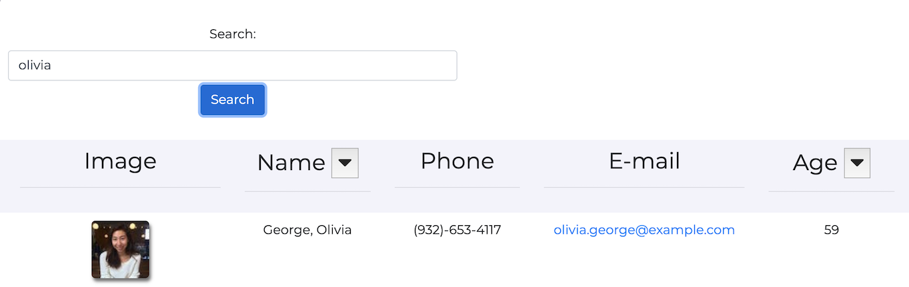

# Employee Directory
An employee search application using React, allowing users to view all of their employees information on one page. 
 

https://shelbypalumbo.github.io/Employee-Directory/

## User Story
As a business owner, I want the ability to view, sort, and search my employee database, so that I can retreive their personal information easier.

## Usage
Users of the Employee Directory can view all employees upon page load, sort employees by last name in ascending and descending order, as well as search for employees by name.

### Main Page

### Employee search

### Employee name sort by ascending and descending order

#### Ascending last names

#### Descending last names

### Employee age sort by ascending and descending order

#### Ascending employee ages

#### Descending employee ages

