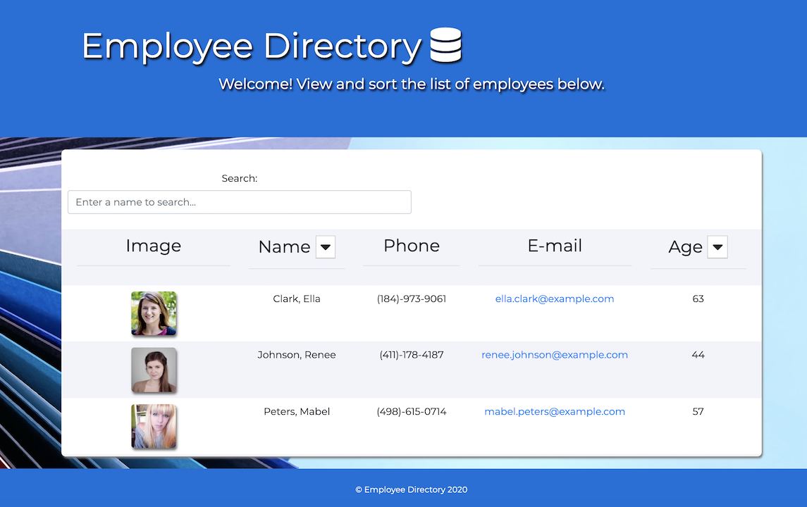

# Employee Directory

An employee search application using React. Users can view and sort all of their employees information on one page.
 

https://shelbypalumbo.github.io/Employee-Directory/

## User Story

As a business owner, I want the ability to view, sort, and search my employee database, so that I can retreive their personal information easier.

## Usage

Users of the Employee Directory can view all employees upon page load, sort employees by last name, or age, in ascending and descending order, as well as search for employees by their first or last name.

### Main Page

### Employee search

### Employee name sort by ascending and descending order

#### Ascending last names

#### Descending last names

### Employee age sort by ascending and descending order

#### Ascending employee ages

#### Descending employee ages

## Technologies Used

- React
- Node.js
- HTML
- CSS
- Javascript
- JSX
- Random User API

### Additional Styling Framework

- Bootstrap | https://getbootstrap.com/
- Fontsawesome icons | https://fontawesome.com/icons?d=gallery&m=free
