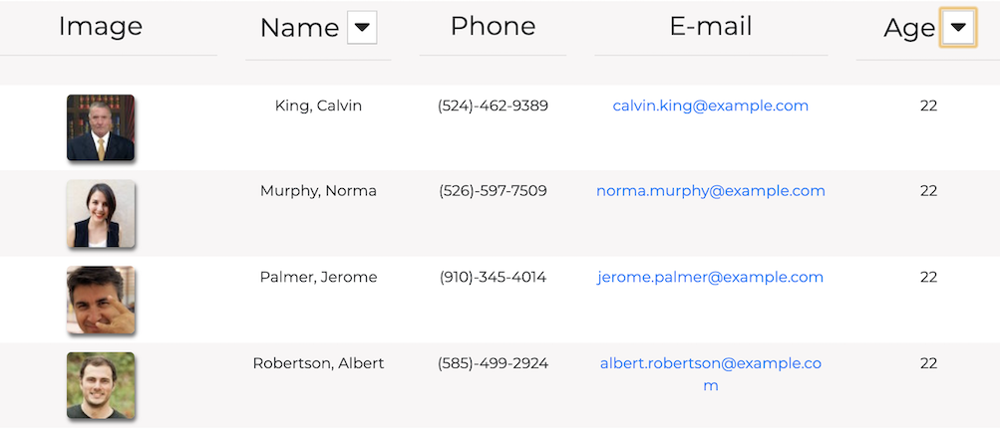

# Employee Directory
An employee directory application using React, allowing users to view all of their employees information on one page. 
 

https://shelbypalumbo.github.io/Employee-Directory/

*** Work in progress - filtering employees by name through user search ***

## User Story
As a business owner, I want the ability to view and sort my employees, so that I can retreive their personal information easier.

## Usage
Users of the Employee Directory can view all employees upon page load, sort employees by last name in ascending and descending order, as well as search employees by name.

### Main Page

### Employee name sort by ascending and descending order

#### Ascending last names

#### Descending last names

### Employee age sort by ascending and descending order

#### Ascending employee ages

#### Descending employee ages
